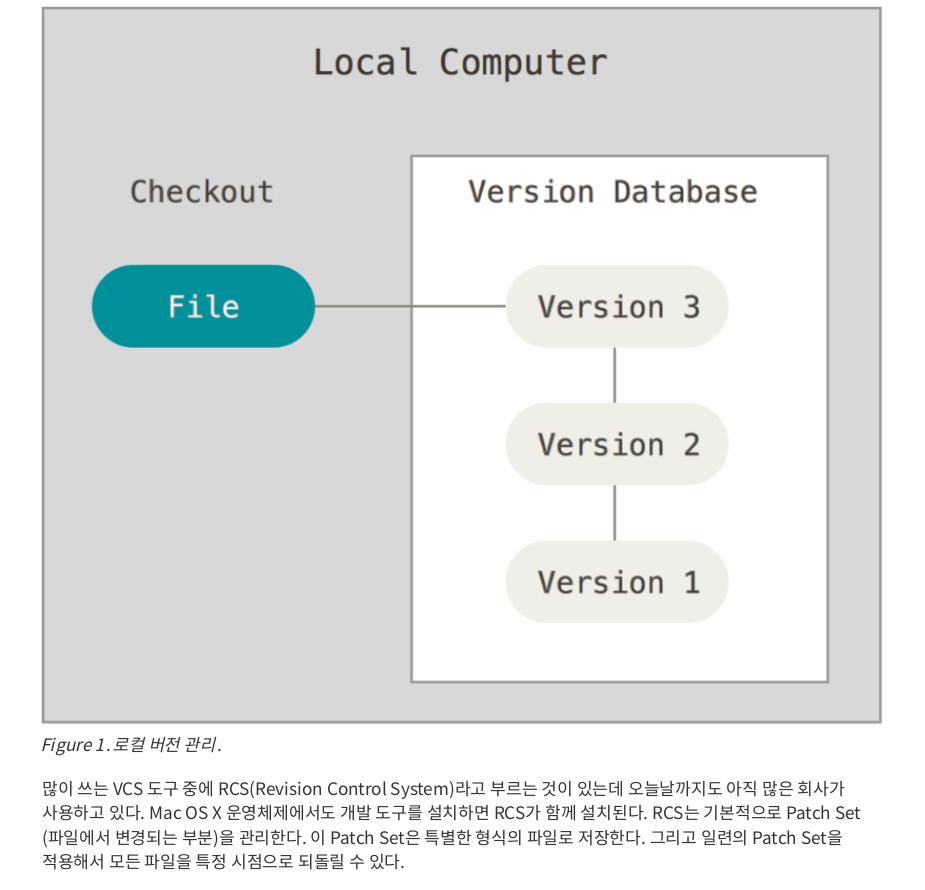
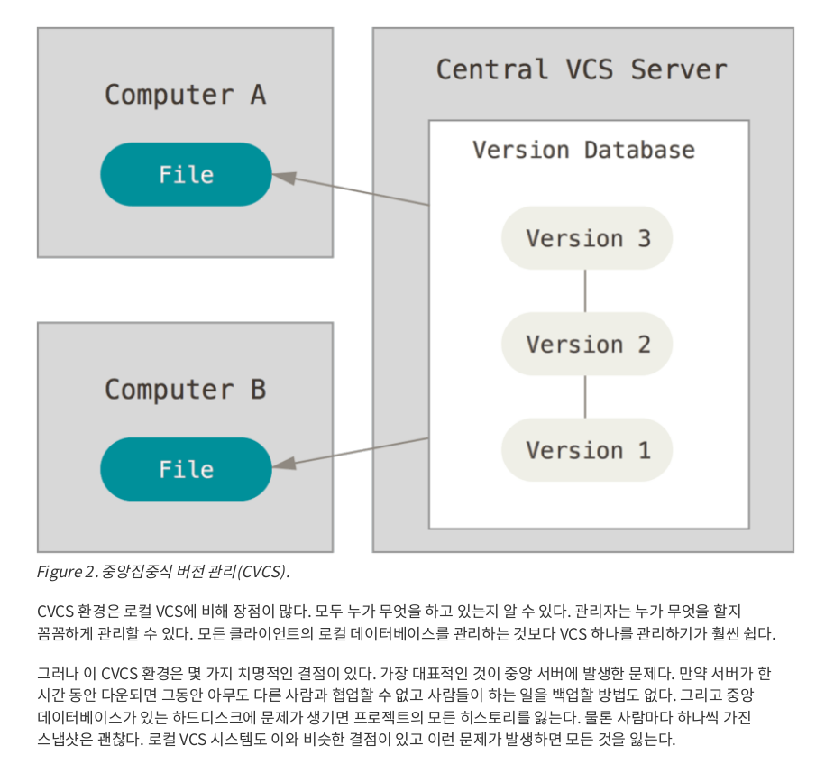
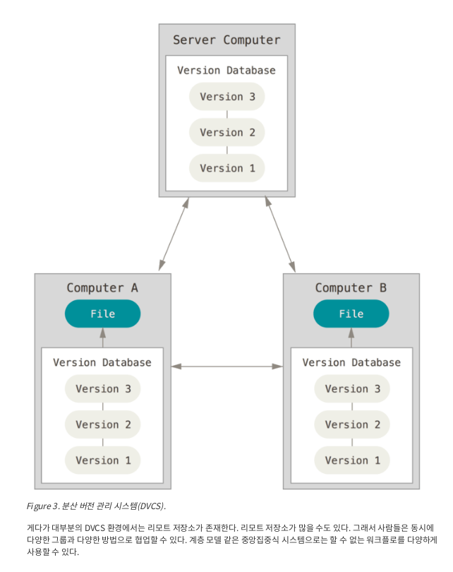

# 버전 관리 시스템 (VCS - Version Control System)
버전 관리 시스템이란 파일의 변화를 시간에 따라 기록했다가 나중에 특정 시점의 버전을 시스템이다. 소프트웨어 소스 코드 뿐만 아니라 실제 거의 모든 파일의 버전을 관리할 수 있다.
즉 그래픽 디자이너도 VCS를 사용해도 문제가 없다. 버전 관리 시스템으로 이미지나 레이아웃, 변경 이력 혹은 수정 내용을 관리하는 것은 매우 현명하다.
VCS를 사용하면 다음과 같은 이점이 있다.
- 각 파일을 이전 상태로 되돌리거나, 프로젝트를 통째로 이전 상태로 되돌릴 수 있다.
- 시간에 따른 수정 내용을 비교해 볼 수 있다.
- 누가 문제를 일으켰는지 추적해 볼 수 있다.
- 누가 언제 만들어낸 이슈인지 알 수 있따.
- 파일을 잃어버리거나 잘못 고쳤을 때 쉽게 복구 할 수 있다.
디
아래의 글을 보고 버전관리시스템의 역사와 필요성에 대해서 공감했다면 80%는 이해했다 볼 수 있다.

## 로컬에서의 버전 관리

VCS를 사용하지 않고 버전 관리를 한다하면(매우 비효율적이지만) 버전마다 디렉토리에 파일을 복사한다. 디렉토리 이름에 시간을 넣어 어느 시점의 버전인지 알기 쉽게 할 수도 있다.
하지만 작업하던 디렉토리를 지워버리거나, 잘못된 렉토리에 복사할 수도 있다. 이런 이유로 프로그래머들은 오래전 로컬 VCS(로컬에서의 버전 관리 시스템)을 만들었다. 로컬 VCS는 간단한 데이터베이스를 사용해서 파일의 변경 정보를 관리할 수 있다. 

## 중앙집중식 버전 관리(CVCS Central Version Control System)

프로젝트를 진행하다 보면 다른 개발자들과 함께 작업해야 하는 경우가 많다. 이럴 때 필요한 CVCS(중앙집중식VCS)는 CVS, Subversion, Perforce같은 파일을 관리하는 서버가 별도로 있고 클라이언트가 서버로부터 파일을 받아 사용(Checkout)한다. 이러한 시스템 수년간 많은 개발자들이 채택해왔다.

## 분산 버전 관리 시스템(DVCS Distributed Version Control Systems)

이제 DVCS(분산 버전 관리 시스템)을 설명할 차례다. 우리가 알아볼 Git부터 Mecurial, Bazaar, Darcs 같은 DVCS에서의 클라이언트는 단순히 파일의 마지막 스냅샷을 사용(checkout) 하지 않는다. 그냥 저장소를 전부 복제(clone)한다. 서버에 문제가 생겨도 이 복제물로 작업을 진행할 수 있다. 클라이언트 중에서 아무거나 골라서 서버를 복원시킬 수 있다. 모든 Checkout은 모든 데이터를 가진 진정한 백업이다.

