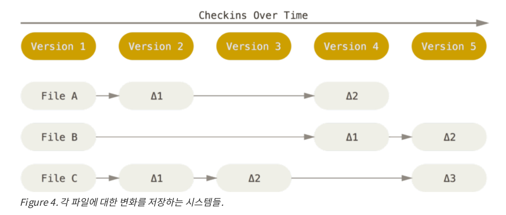
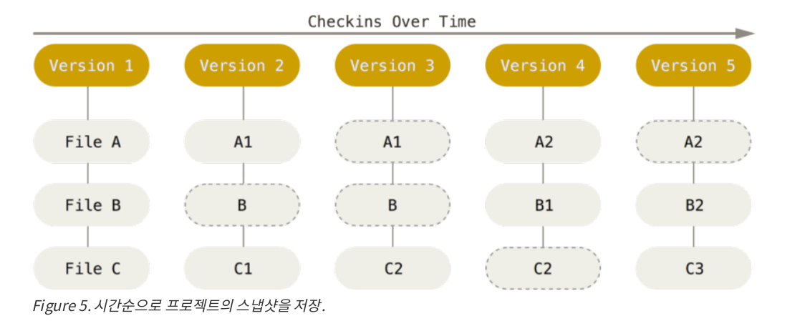
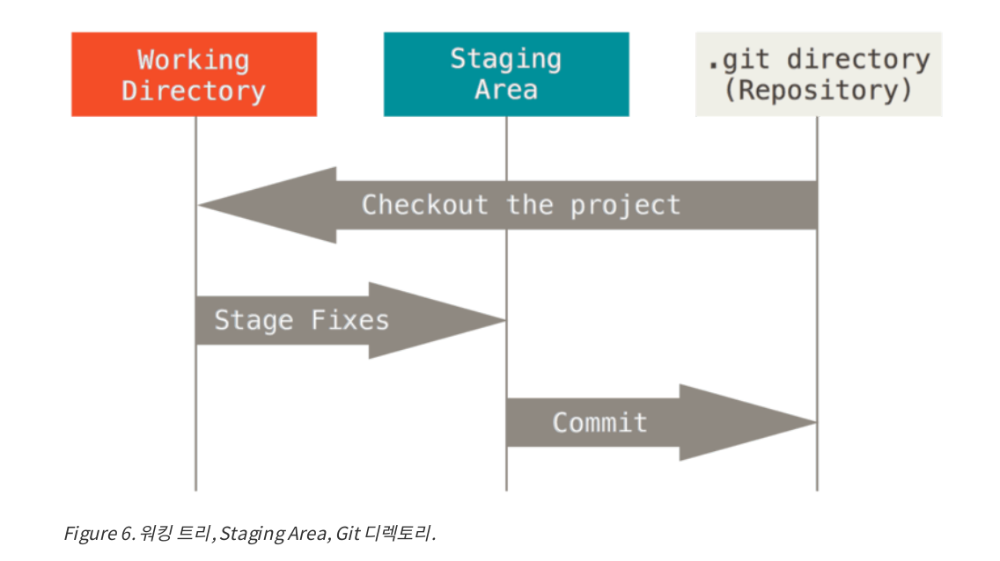

# Git 기초
<p>
이 글은 Git의 가장 핵심을 관통하는 내용을 담았다. 이 글을 이해한다면 Git이 무엇이고 어떻게 동작하는지 이해할 수 있다. 그리고 어떤 심화 기능이 나오더라도 쉽게 이해하고 효과적으로 사용할 수 있다. Git은 다른 VCS와 달라서 헷갈릴 수 있다. 그래서 Subversion이나 Perforce 같은 다른 VCS를 사용하던 경험을 버려야한다. UI는 매우 비슷하지만, 다른 VCS에서 사용하던 개념과는 다르다. 다른 VCS를 경험했던 사람이라면 이런 차이를 감안한다면 Git을 사용하는 것이 어렵지 않다.
</p>


## 차이점은 스냅샷
<p>
Subversion과 Git의 가장 큰 차이점은 데이터를 다루는 방법에 있다. VCS 대부분은 관리하는 정보는 파일이다. CVS, Subversion, Perforce등의 버전 관리 시스템은 각 파일의 변화를 시간순으로 관리하면서 파일의 집합을 관리한다. 아래는 그러한 시스템을 도면화한 사진이다.
</p>

<p>
Git은 위의 버전 관리 시스템과는 다르다. Git은 데이터를 스냅샷으로 취급하고 크기가 작다. Git은 커밋하거나 프로젝트의 상태를 저장할 때 파일이 존재하는 그 순간을 중요하게 여긴다. 파일이 달라지지 않았다면 Git은 성능을 위해 파일 자체를 새로 저장하지 않는다. 단지 이전 상태의 파일 링크만 저장한다. Git은 데이터를 스냅샷으로 취급한다.
</p>

<p>
위의 사진 두장이 Git이 다른 VCS와 다른 점이다. Git은 강력한 도구를 지원하는 작은 파일시스템이다. Git은 단순한 VCS가 아니다. 이는 Git의 Branch를 설명하면서 다시 언급한다.
</p>


## Git의 명령은 대부분 로컬에서 실행된다.
Git은 대부분의 명령이 로컬의 파일과 데이터만 사용하기 때문에 대부분의 명령어가 네트워크의 속도에 영향을 받는 CVCS 보다 훨씬 빠르다. Git은 다른 버전 관리 시스템을 써보지 않은 사람을 모르겟지만(나도 마찬가지로) Git느님이라 불릴 정도로 빠르다. 프로젝트의 모든 히스토리와 파일들이 로컬에 있기 때문에 모든 명령은 순식간에 실행된다. 위에서 말했 듯이 히스토리가 로컬에 있기 때문에 현재 프로젝트와 한 달 전의 프로젝트를 비교해보고 싶을 때도 히스토리를 조회할 때 서버 없이 로컬에서 바로바로 조회할 수 있다. 다른 VCS 시스템처럼 네트워크에 연결된 리모트 서버에 접근해서 예전 버전을 가져올 필요가 없는 것이다. 위에서 들었던 다른 VCS의 예로 Subversion, CVS등은 오프라인일 때 파일을 편집할 수 있지만, 커밋할 수가 없다.

## Git의 무결성
Git은 데이터를 저장하기 전에 항상 체크섬을 구한다. 체크섬이란 체크(Check)확인
(Sum)합이 합쳐진 단어로 저장하기 이전의 데이터를 전부 더한 값이
 저장 후의 데이터를 전부 더한 값이 다른지 확인하여 결함이 있는지 없는지 체크하는 것을 의미한다. Git은 SHA-1라는 해시 사용하여(해시는 암호화 방법을 말한다. 그리 중요한 내용은 아니니 그러한 암호화 방법이 있구나하고 넘어가길 바란다.) 
```
24b9da6552252987aa493b52f8696cd6d3b00373
```
 체크섬을 만든다. 체크섬은 Git이 결함이 없는 무결성을 유지하도록 한다. 또한 여기서 중요한 이야기가 있는데, Git은 모든 것을 SHA-1 해시로 식별해서 파일 이름을 이름으로 저장하지 않고 해당 파일의 해시로 저장한다. 실제로 Git을 사용하다 보면 이러한 값들은 여기저기 보일 것이면 당황하지말고 파일의 또 다른 이름이구나 하면 될 것이다.


 ## Git은 데이터를 추가할 뿐
 Git은 Git 데이터베이스가 존재한다. 그리고 Git으로 무얼 하든 데이터베이스에 추가할 뿐 삭제하거나 되돌릴 수 없다. 일단 스냅샷을 커밋하면 데이터를 잃어버리기지 않게 된다.
 또다른 이점으로는 프로젝트로 여러가지 실험을 막무가내로 실행하더라도 Git에서 데이터를 어떻게 저장하고 손실을 복구하는지 안다면(이는 추후에 나올 예정이다.) 언제든지 복구할 수 있다. 


## 세 가지 상태
Git의 기초에서 가장 중요한 파트인 Commited, Modified, Staged에 대해 얘기한다. Git은 파일을 Commited, Modified, Staged 이렇게 세 가지 사앹로 관리한다. 그럼 각각의 의미를 살펴보자.

첫 번째 Committed란 데이터가 로컬 데이터베이스에 저장된 상태를 말한다.
두 번쨰 Modified란 수정한 파일이 아직 로컬 데이터베이스에 커밋되지 않은 상태다.
세 번째 Staged란 수정한 파일을 곧 커밋할 것이라 표시(체크)해 둔 상태다.

이 세 가지 상태를 순서대로 나열하면, 파일을 수정하고(Modified)  커밋할 파일들을 표시하고(Staged), 표시된 파일들만 로컬 데이터베이스에 커밋한다.(Committed)

## 그리고 Git의 세 가지 단계
여기까지 많이 공부했다. 위의 세 가지 상태는 지금 배울 Git 프로젝트의 세 가지 단계와 깊은 연관성이 있다. 그러니 충분한 휴식과 복습을 하고 다시 공부를 재개하는 것이 어떤가? 앞만 보고 달리는 것보다 휴식하는 것도 공부의 효율성을 높여준다.

그렇다면 세 가지 단계에 대해서 알아보자. 위에서 알아본 세 가지 상태는 Git 프로젝트의 세 가지 단계와 연결되어 있다. Working Directory, Staging Area, Git Directory 이렇게 세 가지를 이해해보자.



Working Directory는 말그대로 내가 작업하는(Working) 폴더(Directory)를 말한다. 여기까지만 이해해도 괜찮으나 더 구체적으로 설명하면 워킹 디렉토리는 특정 버전을 Git 디렉토리에서 찾아 Checkout 한 것이다.(대부분의 워킹 디렉토리는 최신 버전을 checkout한다.) 

깃 디렉토리는 깃이 프로젝트의 메타데이터와 객체를 저장하는 곳으로서, 데이터베이스가 존재한다. 이 깃 디렉토리가 깃의 핵심으로 다른 저장소를 Clone 하거나 Init 하면 Git 디렉토리가 만들어진다. 깃 디렉토리는 로컬의 디스크(보조기억장치)에 저장되어 그 디렉토리안에 데이터베이스에서 파일을 가져와 워킹 디렉토리를 만든다.

Staging Area는 사실상 깃 디렉토리에 존재한다. 단순히 곧 커밋할 파일에 정보를 임시 저장한다. 쉽게 얘기해서 곧 커밋할 파일들은 Stage(어떠한 무대)에 올려두겠다는 의미다.

기본적인  Git의 흐름은 다음과 같다
1.  워킹 디렉토리에서 작업을 한다.(파일이 수정됨)
2.  Staging Area에 파일을 올린다.(커밋할 스냅샷을 만들어진다.)
3.  Stage에 올려진(Staging Area에 올려진) 파일을 커밋하면 깃 디렉토리에 영구적인 스냅샷으로 저장된다.

정리하면 깃 디렉토리 단계에 있는 파일들은 Committed 상태다. 파일을 수정하고 Staging Area에 추가했다면 Staged 상태다. 그리고 수정했지만, 아직 Stage하지 않았으면 Modified 상태이다. 

## 내림글
많이 왔다. 여기까지만 이해해도 충분히 깃을 사용하는데 한층 수월하고 정말로 내가 깃을 사용하고 있다는 느낌을 받을 수 있을 것이다. 이후에는 Branch나 Reset 부터 다양한 심화 명령들이 나올 것인데. 우선 지금 배운것 부터 프로젝트에 적용하고 이후에 더 공부해보는 것을 추천한다. 왜냐하면 이 정도만 알아도 프로젝트하기에는 충분하기 때문이다. 여기까지 공부한 스스로에게 칭찬으로 롤 한판 하는것은 어떨까?

