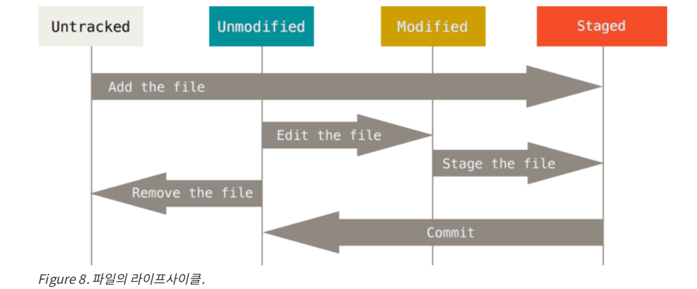

# 깃 저장소 만들기
깃 저장소를 만드는 방법은 두 가지가 있다.
1. 기존 프로젝트의 디렉토리를 깃 저장소로 만든다.
2. 리모트 서버(대표적을 깃허브가 있다)에 있는 저장소를 Clone 한다.

## 기존 프로젝트의 디렉토리를 깃 저장소로 만들 때
간단하게 기존 프로젝트의 디렉토리에서 "git init" 명령어를 실행하면 된다. 이 명령은 .git 이라는 디렉토리를 만든다. 이 디렉토리는 저장소의 뼈대 파일(Skeleton)이 들어있다. .git 디렉토리에 대한 자세한 내용은 Git 내부에서 따로 정리해두었다.
깃이 파일을 관리하게 하려면 저장소에 파일을 추가하고 커밋해야한다. git add 명령으로 파일을 추가하고 git commit 명령으로 커밋한다. 

```
git add test.txt
git commit -m 'test commit'
```

## 다른 저장소를 Clone 하기
다른 프로젝트에 참여하거나 깃 저장소를 복사하고 싶을 때 git clone 명령을 사용한다. 

```
$ git clone https://github.com/libgit2/libgit2
$ git cloen https://github.com/libgit2/libgit2 mylibgit
```
이 명령어는 'libgit2'라는 디렉토리를 만들고 그안에 .git 디렉토리를 만든다. 그리고 저장소의 데이터를 모두 가져온 뒤 가장 최신 버전을 Checkout 한다. (여기서 Checkout의 의미를 정리해보자면 사전에선 점검한다는 의미로 사용되는데 깃에서는 버전을 점검한다고 직역하여 생각해도된다. Checkout하여 각 버전을 옮겨다닐 수 있다.)  이 두 명령의 차이점은 아래는 디렉토리 이름을 "mylibgit"으로 하여 생성한다.

# 수정하고 저장소에 저장하기
이제 파일을 수정하고 수정된 파일의 스냅샷을 저장소에 커밋해보자(저장소에 커밋을 한다는 의미는 저장한다는 의미와 같다.). 워킹 디렉토리에서의 파일들은 Tracked(관리 상태) Untracked(비관리 상태)로 나뉜다. 그리고 Tracked 파일은 Unmodified(수정하지 않음), Modified(수정함), Staged(곧 커밋함)로 나뉜다.

워킹 디렉토리 파일
- Tracked
    - Modified
    - Unmodified
    - Staged
- Untracked

한번 생각해보자 처음 저장소를 Clone하면 워킹 디렉토리의 파일들은 어떤 상태일까? 정답은 Tracked 이면서 Unmodified 상태다. 파일을 Checkout하고 아무것도 수정하지 않은 상태이기 때문이다. 당연하겠지만 파일을 수정하면 그 파일은 Modified(수정함)상태가 된다. 그리고 Modified상태에서 Staged(커밋할 준비가 됨)상태가 된다. 마지막으로 Staged 상태의 파일을 Commit 하면 저장소에 스냅샷이 저장된다. 그림으로 확인해보자.



## 파일 상태 확인하기
위와 같이 복잡한 파일의 상태를 확인하는 명령어가 깃에 존재한다. 바로 git status다. clone한 후 이 명령어를 실행하면 아래와 같은 메시지를 볼 수 있다.

```
$ git status
On branch master
Your branch is up-to-date with 'origin/master'
nothing to commit, working directory clean
```
 다른 문장은 넘어가도 좋다. 하지만 마지막 문장을 보면 커밋할 사항이 없다는 메시지가 뜬다. 즉 파일은 하나도 수정되지 않았다는 의미다. 여기서 Untracked 파일은 수정되었다 하더라도 목록에 나타나지 않는다. 이를 해결하기 위해서는 git add /<파일명> 명령어로 파일을 추가해주면 된다.

 그리고 두번째 "On branch master" 문장은 기본 브랜치가 master이기 때문에 현재 브랜치가 "master"로 나온다 브랜치는 나중에 천천히 공부하면 되니 안심하고 넘어가자.

 git add는 Untracked 상태의 파일을 Tracked 상태로(정확히는 Staged인데 위에서 봤듯이 Staged는 Tracked 상태의 일종이다.) 만들어 주었지만, Tracked 파일이 수정되었을 때 Staged 상태로 만들어 주기도 한다. 또한 Merge 할 때 충돌난 상태의 파일을 Resolve 상태로 만들 때 사용된다. add의 의미는 프로젝트에 파일을 추가한다기 보다 다음 커밋에 추가한다는 의미로 받아드리는게 좋다.

# 파일 무시하기
중요한 파일이나 리모트 서버에 올라가면 안되는 파일이라면 깃에 저장소에 저장되면 안된다. 그런 중요 파일을 깃 저장소가 무시하게 하려면 .gitignore 파일을 만들어 그 안에 파일이름을 적으면 된다. .gitignore에는 일정의 패턴도 존재하기 때문에 필요할 때마다 찾아보자.

.gitignore 파일에 입력하는 패턴4
- 아무것도 없는 라인이나, '#'로 시작하는 라인은 무시한다.
- 표준 Glob 패턴을 사용한다.
- 슬래시(/)로 시작하면 하위 디렉토리는 적용되지 않는다.
- 디렉토리는 슬래시(/)를 끝에 사용한다.
- 느낌표(!)로 시작하는 패턴의 파일은 무시하지 않는다.

>Glob 패턴이란 정규 표현식을 단순하게 만든 것이다. '*'는 문자가 0개 이상을 말하고 [abc]는 대괄호 안에 있는 문자중 하나를 의마한다. 물음표(?)는 문자 하나를 말한다. [0-9]처럼 대괄호 안에 하이픈(-)을 사용하면 0~9까지를 말한다. '*'를 두개 사용하면 디렉토리 안의 디렉토리를 지정할 수 있다. 'a/**/z 패턴은 a/z, a/b/z, a/b/c/z 모두 지정한다.

.gitignore 파일의 예
```
# 확장자가 .a인파일무시
*.a

# 윗라인에서확장자가 .a인파일은무시하게했지만 lib.a는무시하지않음
!lib.a

# 현재디렉토리에있는 TODO파일은무시하고 subdir/TODO처럼하위디렉토리에있는파일은무시하지않음
/TODO

# build/ 디렉토리에있는모든파일은무시
build/

# doc/notes.txt 파일은무시하고 doc/server/arch.txt 파일은무시하지않음
doc/*.txt

# doc 디렉토리아래의모든 .pdf 파일을무시
doc/**/*.pd
```

# 변경 내용 보기
단순히 파일이 변경된 것이 아니라 어떤 내용이 변경되었는지 살펴보려면 git status가 아니라 git diff 명령을 사용해야 한다. 

- git diff: 워킹 디렉토리의 것과 Modified 것을 비교
- git diff --staged: Staged 것과 저장소에 커밋한 것을 비교

파일을 Stage 한 후에 다시 수정해서  git diff를 한경우 Staged와 Unstaged의 파일을 비교한다.

참고로 git diff --cached 옵션은 --staged와 같은 옵션으로 Staged 것과 저장에 커밋한 것을 비교한다.

>. git diff대신 git difftool명령을 사용해서 emerge,vimdiff 같은 도구로 비교할 수 있다. 상용 제품도 사용할 수 있다. git difftool --tool-help라는 명령은 사용가능한 도구를 보여준다.

 # 커밋하기
 git commit을 하면 Staged된 파일들을 깃 저장소에 저장한다. 커밋 메시지는 git commit -m "commit message" 처럼 첨부할 수도 있고 편집기를 이용해서 할 수도 있다.

 ## Staging 생략하고 커밋하기
